  

  

  
  &nbsp;
  
  &nbsp;
  

---

## About Me

I build and maintain deployed full-stack web applications for real users and small businesses.

My background covers frontend development with Angular and TypeScript, backend API work, database integration, deployment, and security-focused project maintenance. I take projects from concept to live deployment with ownership, billing, infrastructure, and long-term maintainability in mind.

> Machinist turned Full-Stack Developer. Same mindset. Different tools.

---

## What I Build

I build full-stack web applications, business websites, and client-focused web tools with an emphasis on clean structure, maintainability, and real deployment.

My work covers frontend interfaces, backend APIs, database integration, authentication flows, deployment setup, environment configuration, and security review.

I focus on helping small businesses establish professional web infrastructure: websites, booking flows, database-backed applications, and secure project ownership separation.

---

## Current Focus

- Building and delivering client web projects through **The House of Crimson LLC**, my web services company focused on small business infrastructure
- Secure deployment workflows and production environment hardening
- Separating client, business, and personal infrastructure for clean ownership and billing
- Rapid prototyping and product development

---

## Featured Projects

### Eden: Field Service Operations App
A field-service and lawncare operations prototype built around team workspaces, job records, proof uploads, manager review, and mobile-first workflows. Helps owners and managers organize crews, saved job sites, before/after photo proof, job details, and reviewable work records from a central dashboard.

**Highlights:** SaaS product planning and feature design · Team workspace architecture · Manager dashboard and report detail views · Before/after photo proof upload workflows · Component and service architecture refactoring

`Angular` `TypeScript` `Firebase` `Mobile-First`

---

### Vibeathon AgTech Prototype
Rapid MVP built during the **Codefi Cape Vibeathon**, solving real operational recordkeeping problems in agriculture. Turns messy field notes, weather data, photos, and application records into structured records that support manager review, compliance workflows, and audit-style documentation.

**Highlights:** MVP planning under hackathon constraints · Product scoping and feature prioritization · Database-backed record system (PostgreSQL + Drizzle) · Moved app state from localStorage to backend persistence · Demo flow planning and submission preparation

`PostgreSQL` `Drizzle ORM` `Node` `Hackathon MVP`

---

### Plumino: Employee Operations Portal
Capstone project built with guidance from a Plumino developer using realistic biotech company data provided by the client. Role-based employee portal where data editing permissions are tied to employee roles. Charts and data visualizations update in real time as data is entered.

**Highlights:** Built from client-style requirements and real data structures · Role-based permission modeling · Real-time data visualizations · Kept data-heavy views readable and maintainable

`Angular` `TypeScript` `Node.js` `Firebase`

---

### Avidity Weddings
Full client site built for a wedding planning service. Designed and deployed as a production business website with real clients and real traffic.

**Highlights:** Client-facing business website from concept to deployment · Wedding planning service with full content and service pages · Production deployment with custom domain

[avidityweddings.com](https://avidityweddings.com)

`HTML` `CSS` `JavaScript` `Netlify`

---

## Skills

**Frontend**
`Angular` `TypeScript` `JavaScript` `HTML5` `CSS3` `Responsive Design` `Component Architecture` `Angular Signals` `Angular Routing` `Angular Services` `Forms` `Custom CSS`

**Backend and APIs**
`Ruby on Rails` `Node/Express` `REST APIs` `Authentication Flows` `JWT` `OAuth` `Protected Routes` `Environment Variables`

**Databases and Cloud**
`MongoDB` `Firebase` `Firestore` `PostgreSQL` `Drizzle ORM` `Database Migration` `Infrastructure Separation`

**Deployment and DevOps**
`Netlify` `Render` `Production Builds` `Build Debugging` `Git` `GitHub` `Branch Workflows` `Environment Configuration`

**Security and Maintenance**
`Snyk` `Dependency Audits` `Secrets Review` `Security Branch Recovery` `Production Config Review`

**Product and Prototyping**
`MVP Planning` `Hackathon Execution` `Product Scoping` `Workflow Mapping` `Dashboard UX` `Mobile-First Design` `Demo Prep` `Code Refactoring`

---

## Tech Stack

  

---

## GitHub Stats

  
  &nbsp;
  

  

  

---

## Trophies

  

---

## Contribution Snake

  <picture>
    <source media="(prefers-color-scheme: dark)" srcset="https://raw.githubusercontent.com/BlueCollarGiant/BlueCollarGiant/output/github-contribution-grid-snake-dark.svg"/>
    <source media="(prefers-color-scheme: light)" srcset="https://raw.githubusercontent.com/BlueCollarGiant/BlueCollarGiant/output/github-contribution-grid-snake.svg"/>
    
  </picture>

---

## 3D Contribution Graph

  

---

## The House of Crimson LLC

  

  

I run **The House of Crimson LLC**, a web services company built for small businesses that need more than a template.

We handle full-stack web development, hosting setup, database infrastructure, deployment, security review, and the long-term maintenance that keeps a business's web presence working. If you're a small business owner who needs a developer who thinks like an owner, let's talk.

- **Web Development:** custom sites, web apps, Angular-based frontends
- **Backend and Database:** API integration, MongoDB, Firebase, PostgreSQL
- **Hosting and Deployment:** Netlify, production builds, environment setup
- **Infrastructure Separation:** clean ownership for business, personal, and client accounts
- **Maintenance and Security:** dependency audits, Snyk scans, environment reviews

> [isaiahratliff.dev](https://isaiahratliff.dev) · [LinkedIn](https://www.linkedin.com/in/isaiah-ratliff/)

---

  

  Isaiah Ratliff · The House of Crimson LLC · Full-Stack Web Development

